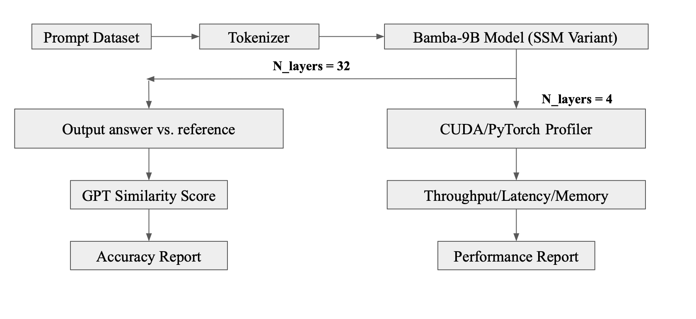
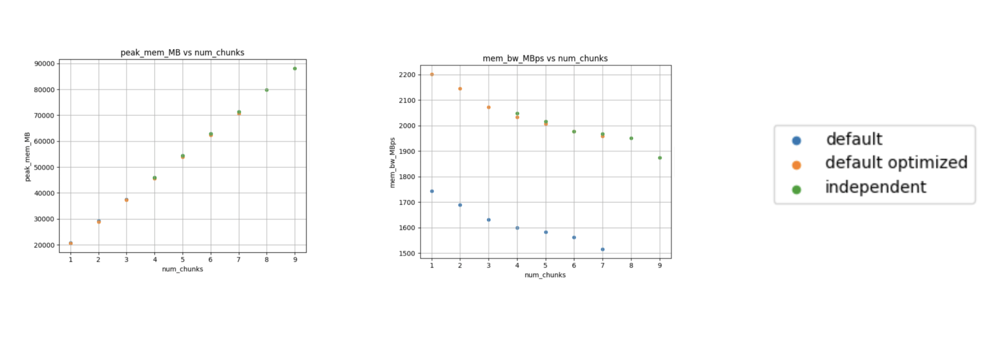
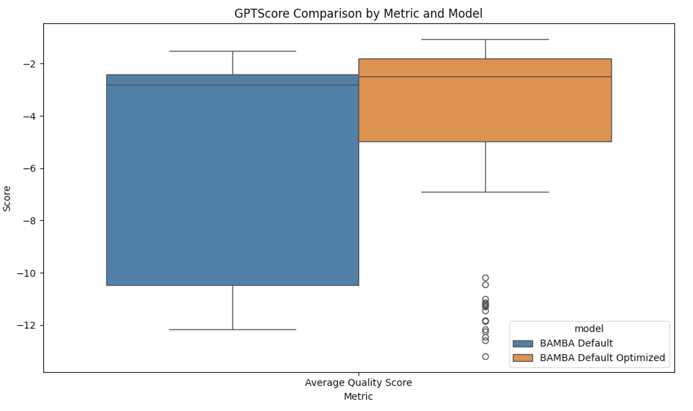
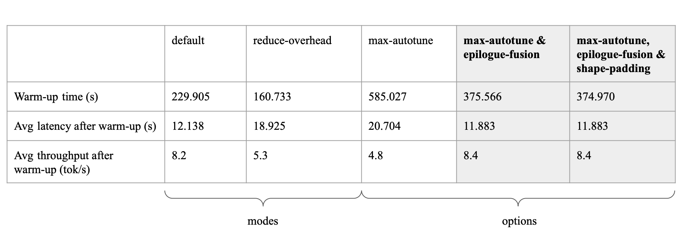

# Divide, Triton, and Conquer 
## Exploring Chunked States in Bamba
Team Members: Rafka Daou, Maria Garmonina, Sarah Korb

The goal of this project is to explore how to reduce memory costs and improve throughput in the current Bamba implementation by modifying the model’s chunking mechanism for processing input sequences.

We evaluated Bamba’s performance by varying:

- Chunking strategies (default, default optimized, and independent)
- Inference settings (use_cache=True vs. False)
- Model depth (reduced layers for profiling vs. full depth for accuracy) 

## Experimental Flow

| Benchmark Type | # Layers | Use_Cache |
|--------------| ---------- | ------------------ |
| Accuracy        | 32 | True |
|Performance  | 4 | False |

## Evaluation and Key Results

#### Latency and Throughput

The Triton-optimized implementation constantly achieves lower latency and higher throughput compared to the baseline. This improvement is due to reduced kernel overhead, coalesced memory access, and efficient fusion of operations. The independent chunking variant reduces latency by removing interdependencies. 

#### Memory Bandwidth

Both default optimized and independent variants reach higher memory bandwidth than the baseline, with the independent variant achieving the greatest bandwidth - reflecting decreased state-reuse overhead and increased parallelism.

#### Accuracy

Default model produced a wider and lower-scoring distribution, while our default-optimized version achieved higher GPTScores with less variance, showing that low-level optimizations can lead to better output quality due to numerical stability.

#### Compiler-level Optimizations

In addition to evaluating various module architectures, we ran a series of experiments focused specifically on compiler-level speedups. Rather than changing the model itself, we used different modes and options within `torch.compile`. The configuration that delivered the best results combined `max_autotune` with `epilogue_fusion`, achieving an average latency of 11.88 seconds and throughput of 8.4 tokens per second. `Max_autotune` is designed to search for the most efficient kernel implementation, while `epilogue_fusion` reduces GPU overhead by fusing post-processing steps into a single kernel. 

#### Summary

* Implementing the SSM module with a custom Triton kernel (Default Optimized module) led to a 28% increase in throughput and 22% reduction in latency, while also improving prediction quality.
* Introducing independent chunking enabled parallelization, providing similar performance gains as the Default Optimized module.

## Structure and contents of this Repository

* `Benchmarking` Colab notebook that contains: Initialization of the Bamba model architecture, and benchmarking code for both performance and accuracy. The notebook is designed to run sequentially — each cell is arranged in the order of execution. You can open and run it in Google Colab with no additional setup.

* `GPT_Score` Colab notebook to evaluate the accuracy of our model outputs. This notebook uses GPTScore, a metric that computes the negative log-likelihood of a generated output given a reference — effectively measuring how fluent, coherent, and relevant the model's responses are. The notebook loads our model outputs and references, computes the GPTScore, and then visualizes the results through plots such as average and harmonic mean scores across different chunking strategies.

* `./cluster_scripts` -  This contains all the code that was run on the Insomnia cluster to benchmark accuracy and performance including our bash scripts.

* `./benchmarking_data` -  This contains a folder of data used to test benchmarking and accuracy. The data in this folder varies by tokenized length of the prompts.
  
* `fms/modules/indep_ssm.py` - Module removes inter-chunk recurrence by eliminating state caching and cross-chunk dependencies. This enables parallel processing across chunks and reduces latency.

* `fms/modules/default_optimized_ssm.py` - Module implements the standard SSM module with architectural optimizations to reduce runtime bottlenecks. This version preserves the original autoregressive behavior while significantly improving performance through low-level memory and kernel tuning.
  
* Other files are copies of IBM’s ibm-fms repo and are required to define and load the Bamba model with the correct dependencies.

  
## Wandb Project Board: 
 
[Weights and Biases Project](https://wandb.ai/sbk2176-columbia-university/bamba_benchmarking_metric/workspace?nw=nwusersbk2176)

* Contains default and default optimized runs on 20 prompts, measuring Latency / Throughput / Memory Usage
  
